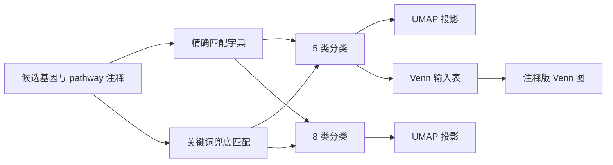

# Lactylation-Selection

> 一个围绕乳酰化相关 DNA 修复候选基因展开的通路分类与可视化项目，包含规则化分类、UMAP 投影和多集合重叠分析。

## 项目简介

本仓库用于整理和分析乳酰化背景下的 DNA damage repair 候选基因。项目将人工整理的通路字典、规则化分类、降维展示和 Venn 交叉可视化串联起来，用来回答这些候选基因在不同 DNA repair 程序中的分布关系。

目前仓库中包含的核心内容有：

- **55 个候选基因**及其通路注释结果
- 一个 **5 类 DNA repair** 分类流程
- 一个 **8 类 DNA repair** 分类流程
- 可直接用于可视化的 UMAP 数据表与图形输出
- 针对主要修复通路重叠关系的 Venn 分析图

## 分析思路



## 两套分类体系

### 5 类分类

5 类版本将候选通路归并为：

- `HR`
- `NHEJ`
- `BER`
- `NER`
- `Others`

这个版本更适合做整体结构展示和较简洁的论文图。

### 8 类分类

8 类版本将修复程序进一步拆分为：

- `HR`
- `NHEJ`
- `BER`
- `NER`
- `MMR`
- `TLS`
- `DRR`
- `CP`

这个版本更适合区分 checkpoint / 通用 DDR 与具体修复路径之间的差异。

## 主要脚本

| 文件 | 作用 |
| --- | --- |
| `Py/classify_5type.py` | 基于精确匹配优先、关键词兜底的 5 类分类脚本 |
| `Py/classify_8type.py` | 扩展到 8 类 repair 程序的分类脚本 |
| `Py/umap_5type.py` | 构建 5 类特征矩阵并导出 UMAP 数据 |
| `Py/umap_8type.py` | 构建 8 类特征矩阵并导出 UMAP 数据 |
| `Py/venn_plot.py` | 绘制带注释的 DNA repair 通路重叠 Venn 图 |
| `Py/unique_pathway.py` | 提取独特 pathway 信号的辅助脚本 |

## 仓库结构

```text
.
├── Py/                         # 分类、UMAP 准备与 Venn 绘图脚本
├── R/
│   ├── filter/                # 处理后的表格和图像输出
│   ├── paper/                 # 支撑分析的数据表
│   ├── genesets.tsv
│   └── kla_ddr_unique.csv
└── README.md
```

## 关键输出

### 分类结果

- `R/filter/classified_symbol.csv`
- `R/filter/pathway_counts.csv`
- `R/filter/divided_symbol.csv`

### 降维与可视化结果

- `R/filter/umap_5type_data.csv`
- `R/filter/umap_8type_data.csv`
- `R/filter/umap_5type.png`
- `R/filter/umap_8type.png`
- `Py/venn_final_corrected.png`

## 图示

<table>
  <tr>
    <td align="center">
      
      <br />
      <sub>5 类 repair 分类下的 UMAP 结果。</sub>
    </td>
    <td align="center">
      
      <br />
      <sub>8 类 repair 分类下的 UMAP 结果。</sub>
    </td>
  </tr>
  <tr>
    <td colspan="2" align="center">
      
      <br />
      <sub>主要 DNA repair 通路之间的候选基因重叠关系图。</sub>
    </td>
  </tr>
</table>

## 数据说明

- 仓库中的通路注释主要以 `STANDARD_NAME` 形式存储。
- 分类不是单一规则判断，而是先走**精确字典匹配**，再用**关键词兜底召回**未命中的通路。
- UMAP 不是直接基于单个标签作图，而是基于每个基因在不同 repair 通路上的组成比例，因此更适合展示 hybrid 类型。

## 复现说明

### Python 依赖

- `pandas`
- `numpy`
- `matplotlib`
- `umap-learn`
- `venn`

### 已有结果

仓库已经保存了 `R/filter/` 下的大部分 CSV、PDF 和 PNG 输出，因此即使不重新跑脚本，也可以直接查看主要结果。

### 重新运行前需要注意

部分 Python 脚本保留了原始分析阶段使用的**绝对路径**。如果要在新的目录结构中复现，请先统一修改路径配置。

## 建议阅读顺序

1. 先打开 `R/filter/classified_symbol.csv` 看最终分类结果。
2. 再看 `R/filter/umap_5type.png` 和 `R/filter/umap_8type.png`，快速把握整体结构。
3. 如果想了解分类规则，重点阅读 `Py/classify_5type.py` 和 `Py/classify_8type.py`。
4. 如果重点在通路重叠解释，则看 `Py/venn_plot.py` 和最终的 Venn 图输出。
