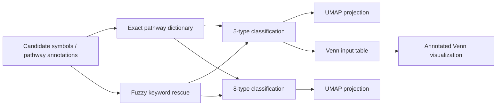
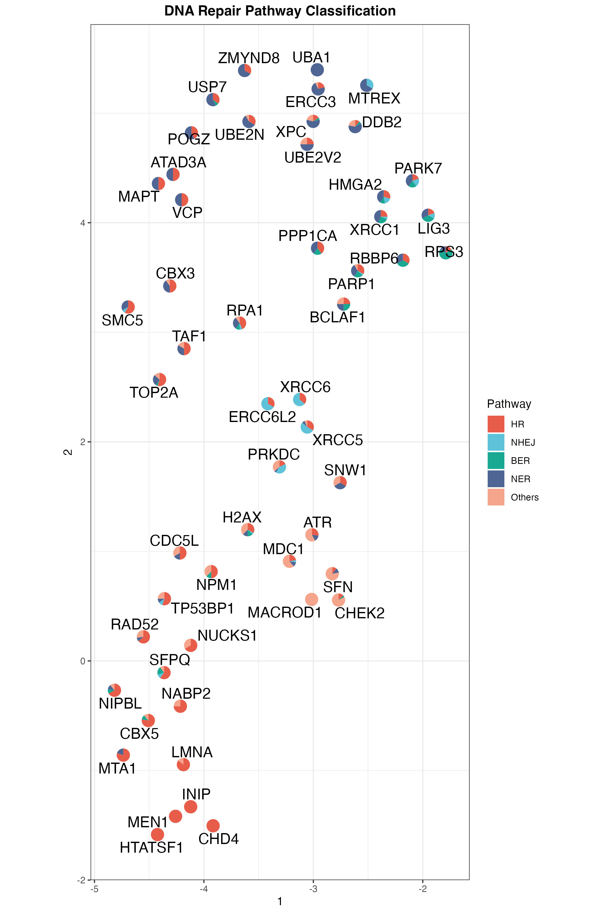
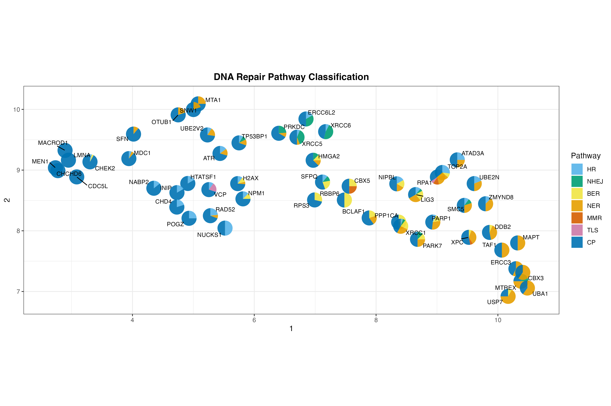
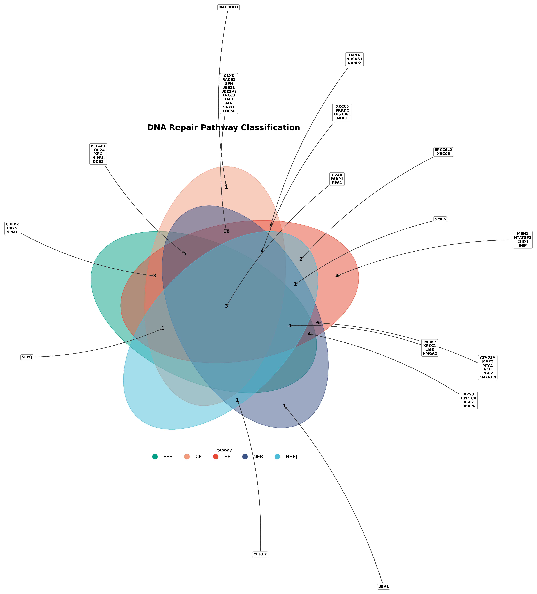

# Lactylation-Selection

> A pathway-centric analysis repository for classifying lactylation-related DNA repair candidates, comparing category systems, and visualizing pathway structure with UMAP and Venn diagrams.

## Overview

This project focuses on selecting and organizing DNA damage repair candidates in a lactylation-related context. The repository combines curated pathway dictionaries, hybrid rule-based classification, dimensionality reduction, and multi-set overlap visualization to summarize how candidate genes distribute across repair programs.

Current materials in the repository include:

- **55 candidate genes** with pathway annotations
- a **5-type** repair classification workflow
- an expanded **8-type** repair classification workflow
- UMAP-ready summary tables and publication-style plots
- Venn-based overlap visualizations for major DNA repair branches

## Analysis Logic



## Classification Systems

### 5-type scheme

The 5-type workflow groups pathways into:

- `HR`
- `NHEJ`
- `BER`
- `NER`
- `Others`

This version is useful for broad structure discovery and for concise figure communication.

### 8-type scheme

The 8-type workflow expands the repair space into:

- `HR`
- `NHEJ`
- `BER`
- `NER`
- `MMR`
- `TLS`
- `DRR`
- `CP`

This version is more suitable when checkpoint signaling and specialized repair branches need to be separated from the major repair classes.

## Main Scripts

| File | Role |
| --- | --- |
| `Py/classify_5type.py` | Exact-match-first plus fuzzy-rescue classification into five repair groups |
| `Py/classify_8type.py` | Expanded eight-group classification with general DDR / checkpoint handling |
| `Py/umap_5type.py` | Builds 5-type feature matrix and exports UMAP-ready coordinates |
| `Py/umap_8type.py` | Builds 8-type feature matrix and exports UMAP-ready coordinates |
| `Py/venn_plot.py` | Draws annotated Venn figures for overlapping repair memberships |
| `Py/unique_pathway.py` | Utility for extracting unique pathway signals from the candidate set |

## Repository Layout

```text
.
├── Py/                         # classification, UMAP preparation, Venn plotting
├── R/
│   ├── filter/                # processed tables and figure outputs
│   ├── paper/                 # supporting dataset tables
│   ├── genesets.tsv
│   └── kla_ddr_unique.csv
└── README.md
```

## Key Outputs

### Classification results

- `R/filter/classified_symbol.csv`
- `R/filter/pathway_counts.csv`
- `R/filter/divided_symbol.csv`

### Embedding and visualization

- `R/filter/umap_5type_data.csv`
- `R/filter/umap_8type_data.csv`
- `R/filter/umap_5type.png`
- `R/filter/umap_8type.png`
- `Py/venn_final_corrected.png`

## Figures

<table>
  <tr>
    <td align="center">
      
      <br />
      <sub>Five-class UMAP view of the candidate genes.</sub>
    </td>
    <td align="center">
      
      <br />
      <sub>Eight-class UMAP view with finer repair-category separation.</sub>
    </td>
  </tr>
  <tr>
    <td colspan="2" align="center">
      
      <br />
      <sub>Annotated overlap map across major repair pathways.</sub>
    </td>
  </tr>
</table>

## Data Notes

- The repository stores pathway annotations in `STANDARD_NAME`-style lists.
- Classification is not based on one rule only: it uses **exact pathway dictionaries first**, then falls back to **keyword rescue** for unmatched entries.
- The downstream UMAP coordinates are computed from pathway-composition proportions rather than raw labels, so hybrid genes remain interpretable.

## Reproducibility

### Python dependencies

- `pandas`
- `numpy`
- `matplotlib`
- `umap-learn`
- `venn`

### R-side outputs

The repository already contains processed CSV, PDF, and PNG outputs under [`R/filter/`](R/filter), so you can inspect the results directly even without rerunning the scripts.

### Important note before rerunning

Like many analysis notebooks/scripts built during active project work, several Python files still use **absolute local paths**. Update those paths before running the pipeline in a new environment.

## Recommended Reading Order

1. Open `R/filter/classified_symbol.csv` to see the final labels.
2. Check `R/filter/umap_5type.png` and `R/filter/umap_8type.png` for overall structure.
3. Use `Py/classify_5type.py` and `Py/classify_8type.py` to understand the rule system.
4. Use `Py/venn_plot.py` if your focus is overlap interpretation and figure generation.
